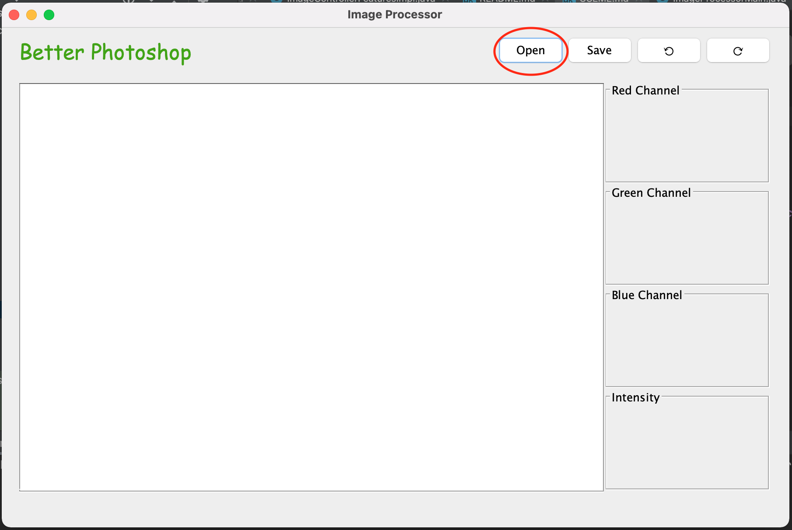
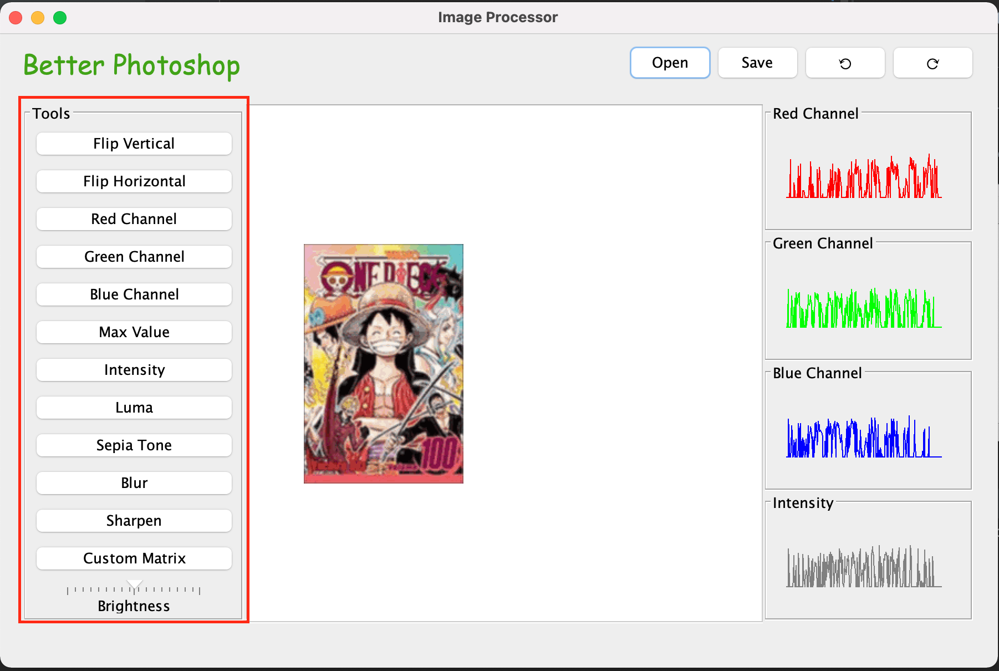
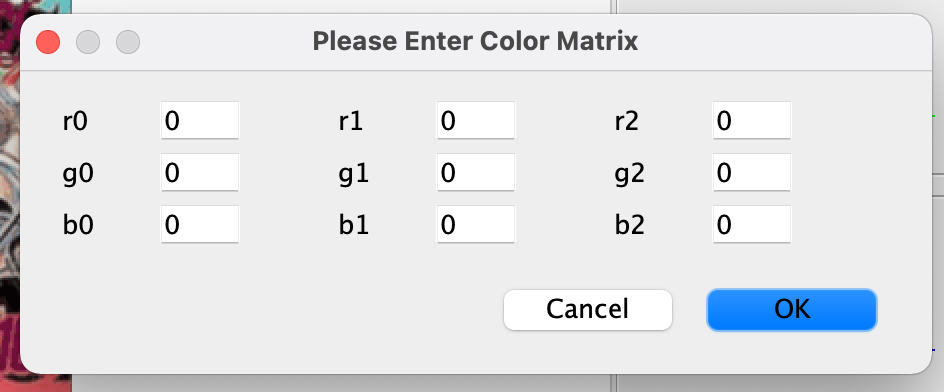
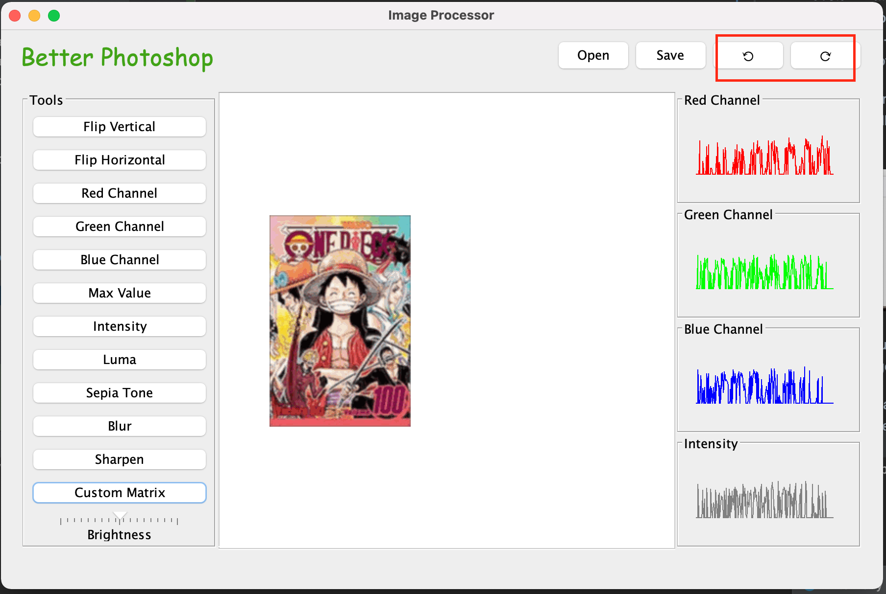
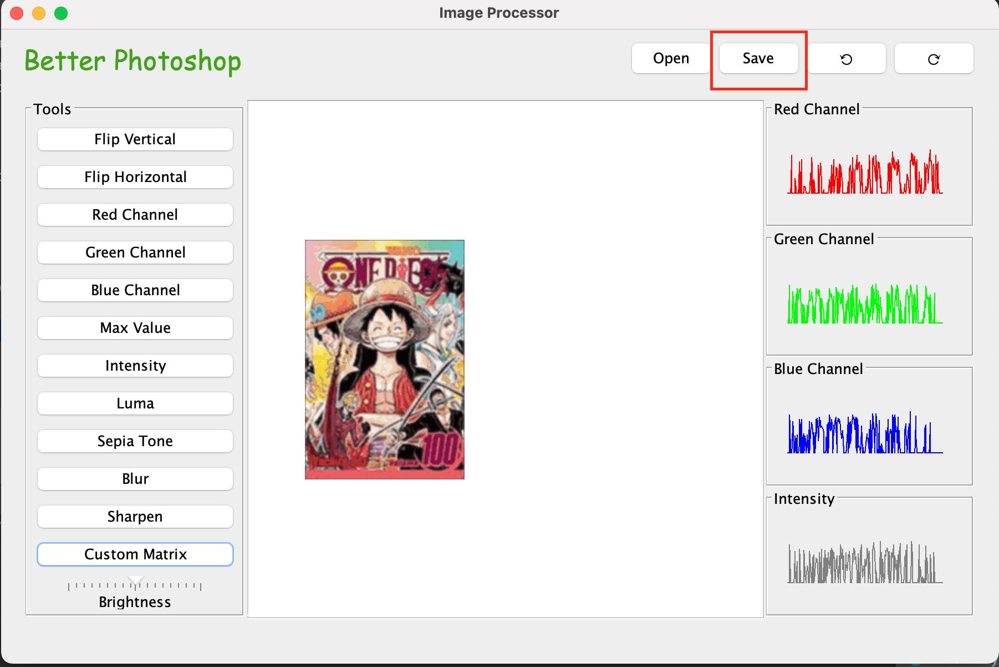

## Command-line Arguments
To start the application, open a terminal (or command prompt) and 
navigate to the directory containing this application's <code>.jar</code>
file. 

<i>Please note: When using custom scripts, make sure that any 
file paths can be accessed from the location of the <code>.jar</code> file.

To run the application with a script <code>.txt</code> file, enter:
<code>java -jar Program.jar -file path-of-script-file </code>

To run the application in CLI mode, enter:
<code>java -jar Program.jar -text</code>

To run the application in GUI mode, enter:
<code>java -jar Program.jar</code>

## Using the GUI 

#### Loading an image:
One must load an image before making any edits. To do this, simply 
click on the "Open" button at the top of the window. From there, 
select an appropriate image file.

After opening an image for the first time, the toolbar panel will appear on
the left-hand side:

The toolbar contains the following buttons:
- Flip Vertical -- flips the image vertically
- Flip Horizontal -- flips the image horizontally
- Red Channel -- converts the image to greyscale based on the red channel
- Green Channel -- converts the image to greyscale based on the green channel
- Blue Channel -- converts the image to greyscale based on the blue channel
- Max Value -- converts the image to greyscale based on the maximum RGB value per pixel
- Intensity -- converts the image to greyscale based on intensity
- Luma -- converts the image to greyscale based on luma
- Sepia Tone -- applies a sepia color transformation to the image
- Blur -- applies a gaussian blur to the image 
- Sharpen -- sharpens the image
- Custom Matrix -- allows a user to apply a custom color transformation (see below)
- Brightness -- this slider allows the user to adjust the brightness of the image

To apply a custom matrix, click on the "Custom Matrix" button in the toolbar. 
This should open up the following panel:

In this panel, you may enter coefficients to adjust the color of the image.
Click "OK" to submit the change. 

To undo or redo any operations, click on the back and forward arrows respectively:

To save an image, click on the "Save" button at the top of the window:

To edit a different image, it is recommended that you save your current changes, 
then click on "Open" to open a new image. 

## Script Commands

#### The following consists of all the script commands our application currently supports:
load\
save\
brighten\
vertical-flip\
horizontal-flip\
red-component\
green-component\
blue-component\
value-component\
intensity-component\
luma-component\
blur\
sharpen\
sepia\
greyscale\
format\
menu\
stored-images\
q\
Q

## **Purpose, Usage, Example**

The following consists of the purpose, and way to use each script command

### **Load**
**Purpose:** load an image from a specified filepath.\
**Usage:** load image-path image-name\
**Example:**\
load res/oneJPG.jpg newJPG\
q

### **Save**

**Purpose:** save the image to a specified filepath.\
**Usage:** save image-path image-name\
**Example:**\
load res/oneJPG.jpg newJPG\
brighten 100 newJPG brightJPG\
save res/newBrightenedJPG.jpg brightJPG\
q

### **Brighten**
**Purpose:** brighten or darken the image.\
The increment determines how much to brighten (positive) or darken (negative) it.\
**Usage:** brighten increment image-name dest-image-name\
**Example:**\
load res/oneJPG.jpg newJPG\
brighten 100 newJPG brightJPG\
q

### **Vertical-flip**
**Purpose:** flips the image upside-down.\
**Usage:** vertical-flip image-name dest-image-name\
**Example:**\
load res/oneJPG.jpg newJPG\
vertical-flip newJPG verticalJPG\
q

### **Horizontal-flip**
**Purpose:** flips the image horizontally.\
**Usage:** horizontal-flip image-name dest-image-name\
**Example:**\
load res/oneJPG.jpg newJPG\
horizontal-flip newJPG horizontalJPG\
q

### **Red-Component Greyscale**
**Purpose:** creates a greyscale image with the red-component.\
**Usage:** red-component image-name dest-image-name\
**Example:**\
load res/oneJPG.jpg newJPG\
red-component newJPG redJPG\
q

### **Green-Component Greyscale**
**Purpose:** creates a greyscale image with the green-component.\
**Usage:** green-component image-name dest-image-name\
**Example:**\
load res/oneJPG.jpg newJPG\
green-component newJPG greenJPG\
q

### **Blue-Component Greyscale**
**Purpose:** creates a greyscale image with the blue-component.\
**Usage:** blue-component image-name dest-image-name\
**Example:**\
load res/oneJPG.jpg newJPG\
blue-component newJPG blueJPG\
q

### **Value-Component Greyscale**
**Purpose:** creates a greyscale image with the value-component.\
**Usage:** value-component image-name dest-image-name\
**Example:**\
load res/oneJPG.jpg newJPG\
value-component newJPG valueJPG\
q

### **Intensity-Component Greyscale**
**Purpose:** creates a greyscale image with the intensity-component.\
**Usage:** intensity-component image-name dest-image-name\
**Example:**\
load res/oneJPG.jpg newJPG\
intensity-component newJPG intenseJPG\
q

### **Luma-Component Greyscale**
**Purpose:** creates a greyscale image with the luma-component.\
**Usage:** luma-component image-name dest-image-name\
**Example:**\
load res/oneJPG.jpg newJPG\
luma-component newJPG lumaJPG\
q

### **Blur**
**Purpose:** blur the image.\
**Usage:** blur image-name dest-image-name\
**Example:**\
load res/oneJPG.jpg newJPG\
blur newJPG blurImage\
q

### **Sharpen**
**Purpose:** sharpens the image.\
**Usage:** sharpen image-name dest-image-name\
**Example:**\
load res/oneJPG.jpg newJPG\
sharpen newJPG sharpImage\
q

### **Sepia**
**Purpose:** greyscale the image through sepia.\
**Usage:** sepia image-name dest-image-name\
**Example:**\
load res/oneJPG.jpg newJPG\
sepia newJPG sepiaGreyJPG\
q

### **Greyscale**
**Purpose:** a custom greyscale for the users.\
They can choose however to greyscale the image.\
They do this by selecting the specific red, green, blue increment they would like to input.\
(Note: There is no limit so inputs that are negative or over 255 will work).\
**Usage:**\
greyscale redIncrement greenIncrement blueIncrement image-name dest-image-name\
**Example:**\
load res/oneJPG.jpg newJPG\
greyscale 0.2 0.3 0.45 newJPG customGreyJPG\
q

**NOTE: If one would like to use this greyscale to test luma...**\
**Example:**\
load res/oneJPG.jpg newJPG\
greyscale 0.2126 0.7152 0.0722 newJPG lumaGrey\
q

### **Format**
**Purpose:** allows users to view all supported formats that this app provides\
**Usage:** format\
**Example:**\
load res/oneJPG.jpg newJPG\
format\
q

### **Menu**
**Purpose:** allows users to view all commands and its usage\
**Usage:** menu\
**Example:**\
load res/oneJPG.jpg newJPG\
menu\
q

### **Stored-Images**
**Purpose:** allows users to view all images they have modified and named\
**Usage:** stored-images\
**Example:**\
load res/oneJPG.jpg newJPG\
stored-images\
q

### **q** or Q
**Purpose:** allows users to quit anytime\
**Usage:** q or Q\
**Example:**\
load res/oneJPG.jpg newJPG\
q

## **Script Text File** ##
This is for using the command line.

Our main inputs require one to first type "-file"\
It is followed with a valid filepath to a .txt file that contains script commands.
We have included a txt file to run. To run it, make sure to check the info to write the appropriate filepath.

## **Conditions**
The command "load" must be used before any other command in the application.\
(The only exceptions are "q" or "Q")

The command "load" must receive a valid and existing filepath.\
The extension must be one that the application supports.\
As a reference, this includes .ppm, .jpg, .jpeg, .bmp, .png

The command "save" must produce a valid filepath with an extension that the application supports.
The name given to the save must also exist.\
(This means any modification to a loaded image must first be modified before saving).

Make sure that the original name is typed before the dest-image-name for all modifications.

## **Additional Functionalities** ##
One is able to load a .ppm image and save it as a .png image.\
This applies to every other image as well!

## **Final Notes**
This is regarding our design choice for "greyscale" for this assignment\
We understand the purpose of redoing luma.\

Since our original implementation of luma 
consists of something similar to the matrix multiplication, 
we thought it would just be duplication in our case, 
and so we modified the greyscale to be a custom one.
This means if one wants to use luma with greyscale, they can. 
They would just need to enter the specific values themselves to customize it.
The benefit to this though is we do not have duplication code 
as this new greyscale serves an entirely new purpose,
where it allows the users to input whatever values they wish to greyscale 
however they want instead of this simply being luma.

Of course, we can still implement it the way professors want us to do it easily.\
We would just have our colorsTransformation() method within the greyscale method,
and set the matrix to the values of luma. Now, we can edit the greyscale 
method to only take in two parameters, (name, destName),
and have the controller only scan for those two values instead of five for the customization.

This would be how we implement what the professors want (where users can use greyscale and just enter two values, name and destName), but we don't do it as we feel it is code duplication in our unique case.
